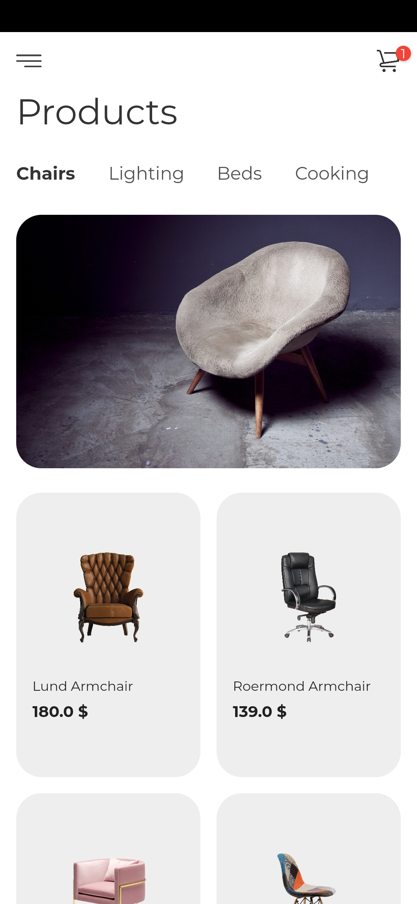
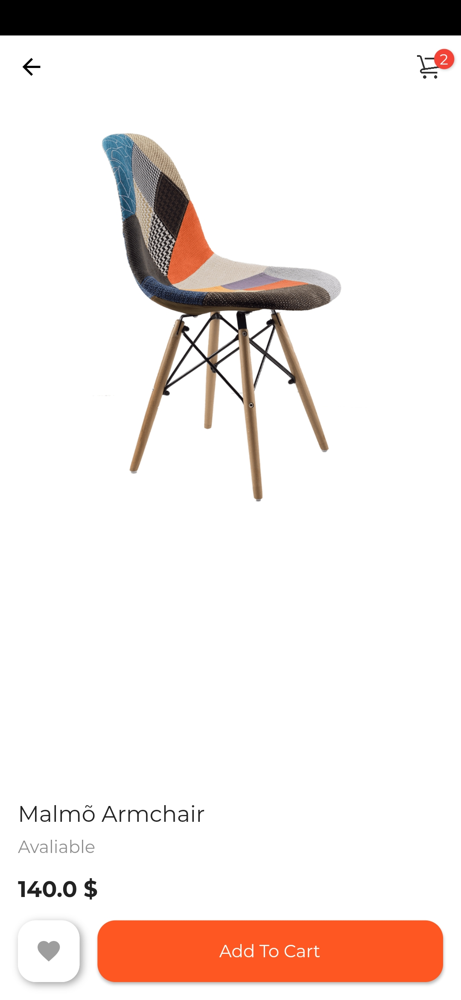
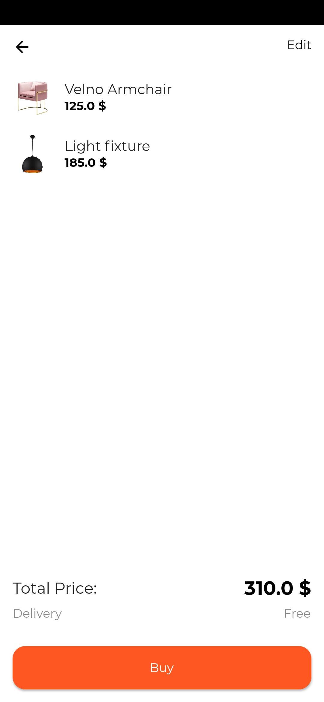

# Furniture Design
Designs made with flutter to inspire you

# Technologies

Flutter Modular

MobX

# Images used in this app

https://www.pexels.com

https://www.pixabay.com

https://www.www.hiclipart.com

# Inspiration

https://dribbble.com/shots/9714951-Furniture-App-Personal-Project/attachments/1744944?mode=media

# Home Page

That's the home page. A simple and minimalist design using Tabs and GridView.

# Details Page

That's the details page. When the user taps the favourite button it changes its state to favourited as well as the <b>Add to cart</b> button, using the <b>MobX</b> library to manager their states.

# Cart Page

That's the cart page. It shows the items that's added to cart. The user can delete an item clicking on the <b>edit</b> button. The <b>MobX</b> library changes list state to user be able of editing the list itself.

